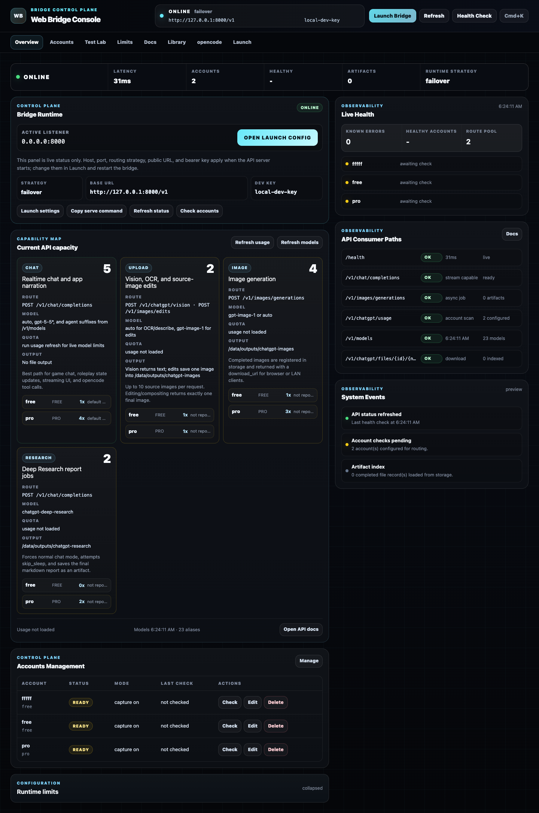
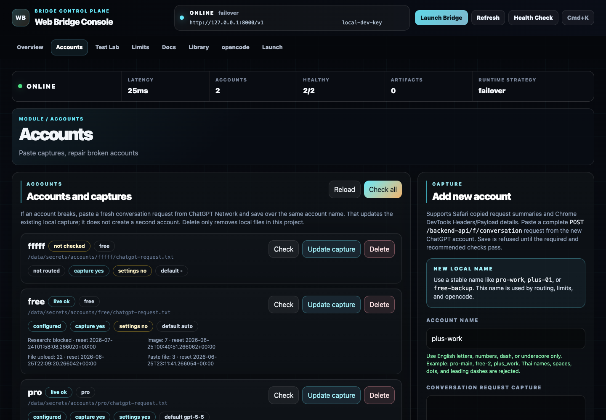
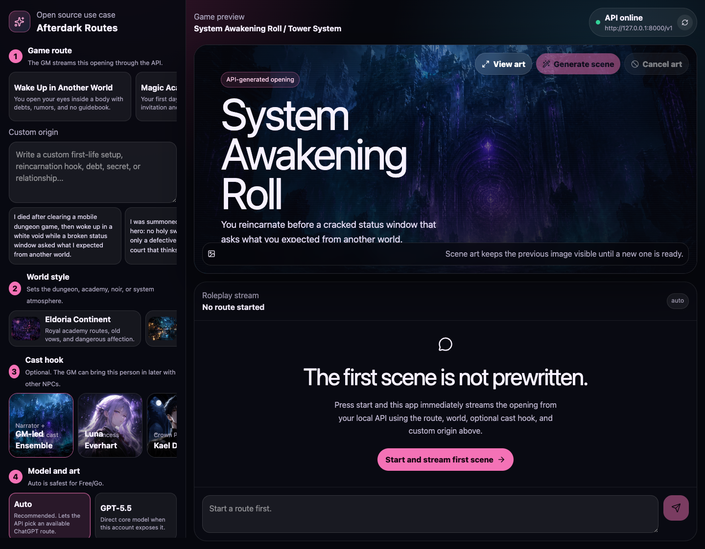

# ChatGPT Web Bridge

Independent local bridge for building real apps on top of ChatGPT Web accounts.

This project provides a local `/v1` HTTP API, an operator console, a CLI, a
Docker stack, an opencode integration, and a full-stack character game use case.
It is designed as a provider-first framework: ChatGPT Web is the first provider,
and the local API gives apps a practical OpenAI-shaped surface without making
the project depend on any one client.



## What This Is

`chatgpt-api` lets you run a local service that can:

- send normal and streaming chat requests through ChatGPT Web
- expose an OpenAI-shaped `POST /v1/chat/completions` route
- route across multiple ChatGPT accounts with failover or balancing strategies
- show live usage, model availability, image quota, and Deep Research quota
- generate images and save completed assets to disk
- edit or combine source images through ChatGPT image generation
- OCR or describe up to 10 input images per request
- run Deep Research and save the finished report as markdown
- return download URLs that work for local browsers and LAN clients
- inject/eject an opencode provider config
- power a separate SvelteKit character game app as a realistic product use case

The goal is not to pretend this is the official OpenAI API. The goal is a useful
local bridge with clear contracts, good operational tooling, and examples that
show what can be built with it.

## Unofficial Status, Risk, And Why This Exists

This project is **not official** and is not affiliated with OpenAI. It drives
ChatGPT Web sessions from copied browser request captures and exposes a local
developer API around that behavior. That puts it in a gray area: it may break
when ChatGPT Web changes, it may be blocked by anti-abuse systems, and account
access can never be guaranteed.

Use it at your own risk:

- Do not run this as a public hosted proxy.
- Do not publish real account captures, cookies, or bearer tokens.
- Prefer a dedicated test account instead of a personal primary account.
- Keep concurrency low, especially for image generation, uploads, and research.
- Expect hidden burst limits even when the UI shows a large daily quota.

For local single-user workflows, the practical risk may be lower than operating
a public scraping service, but nobody can promise that an account will never be
restricted. The safest mental model is: this is an experimental local bridge,
not a supported product contract.

The reason it is still useful is simple: ChatGPT subscriptions and OpenAI API
billing are separate. If you already pay for a high ChatGPT plan such as Pro
(commonly around `$100/month` in supported regions; verify your local plan
price), the web product can include substantial image generation and Deep
Research capacity. Official API image generation is billed separately and can
become expensive at high quality. Verify current pricing before budgeting; as
a reference example for 1024x1024 image generation:

| Quality | Reference per-image API cost |
| --- | ---: |
| low | `$0.006` |
| medium | `$0.053` |
| high | `$0.211` |

This bridge lets local tools use capacity you may already have in ChatGPT Web:
image generation, image editing/compositing, OCR/vision, and Deep Research.
That can also avoid burning Codex usage on tasks Codex is not best suited for:
for example, asking ChatGPT Web Deep Research to produce a markdown report,
then letting Codex read that local file and continue the coding work.

It is especially useful for smaller web products, internal tools, prototypes,
and demos where you want to add AI chat, image generation, OCR, or research
before committing to official API spend. A character/roleplay game is included
in this repository to show that the bridge can drive a real user-facing app,
not just a terminal demo. If you later turn the idea into a serious hosted
product, move to a proper production architecture and budget for official APIs
or a hardened provider layer.

Plan support is intentionally conservative:

| Plan | Current project expectation | Personally tested in this repo |
| --- | --- | --- |
| Free | Works for chat plus limited feature buckets exposed by ChatGPT Web. Current live checks include vision/OCR, multi-image upload, and image edit/composite when quota is available. Multiple free accounts can increase local routing capacity, subject to ChatGPT limits. | yes |
| Go | Expected to work through `auto` and plan-limited feature buckets. | not yet |
| Plus | Expected to work with higher quota than Free/Go. | not yet |
| Pro | Works with higher image/research capacity and higher recommended local concurrency. | yes |

The local router can combine several accounts, including free accounts, so chat
capacity can be much higher than a single account. This does not mean the
service is truly unlimited: ChatGPT Web can still apply hidden account, burst,
browser-proof, or abuse limits at any time.

In current testing, a Pro account can report roughly 1,000 image generations
remaining for the day, but that is not the same thing as unlimited burst
capacity. Too many concurrent image jobs can still trigger short hidden
cooldowns. The default local throttle keeps Pro image concurrency at `3` and
research concurrency at `2` for that reason.

## Built Solo In 30 Hours

This project was built by one person in roughly 30 hours as a practical AI
systems and product engineering prototype. It includes the provider layer,
local API, account routing, image/research artifact handling, operator console,
Docker stack, opencode integration, and a full-stack character game use case.

If this repository is useful to you or close to work your team needs, and you
think this level of solo output is valuable, I am open to employment,
contracting, and consulting opportunities around AI tooling, local agents,
automation, full-stack product prototypes, and developer infrastructure.

## Open Source Scope

This is an MIT-licensed open-source project built to make the idea usable and
testable, not to provide a fully polished commercial product for free.

The Bridge Console and Character Game are reference applications. They prove
that the local API can drive real workflows, but they may still have rough UI,
unfinished edge cases, and bugs. They are intentionally included so people can
see the use cases, run them, fork them, open issues, and send pull requests.

The backend is also intentionally scoped as a local bridge and basic product
prototype. If you adapt this into a larger hosted system, you should add the
normal production layers: stronger auth, tenant isolation, stricter CORS,
request auditing, abuse controls, queue durability, account vaulting, secret
rotation, observability, backup/restore, deployment hardening, and a proper
storage lifecycle.

Those requirements are understood. They are outside the scope of a free
30-hour open-source release. If you need a more complete production version,
custom integration, stronger UX, or a hardened hosted setup, hire me.

## What This Is Not

- Not an official OpenAI service.
- Not a full clone of every OpenAI API endpoint.
- Not a hosted proxy. You run it locally or on your own machine.
- Not safe to publish with real captures or cookies. Account captures are
  credentials and must stay private.

Use the wording **OpenAI-shaped** or **Chat Completions-style** for this API.
Some clients can plug in easily, but several parameters and routes are
bridge-specific by design.

## Main Surfaces

| Surface | Default URL / command | Purpose |
| --- | --- | --- |
| Bridge API | `http://127.0.0.1:8000/v1` | Local app-facing API for chat, image, vision, research, files, and admin routes. |
| Bridge Console | `http://127.0.0.1:8080` | Operator UI for health, accounts, capacity, docs, test lab, storage, and opencode setup. |
| Character Game | `http://127.0.0.1:3000` | Full-stack SvelteKit roleplay game that consumes the bridge as a backend. |
| CLI | `python3 -m chatgpt_api` or `chatgpt-api` | Interactive and scriptable control plane for server launch, account management, tests, and artifacts. |
| opencode | `bun integrations/opencode/chatgpt-opencode.mjs` | Consumer setup that points opencode at the local bridge. |

## Quick Start With Docker

Docker is the fastest way to see the whole system. The containers can start
without any ChatGPT account capture, but real chat, image, OCR, and research
requests need at least one saved account.

| Step | What works | What still needs an account capture |
| --- | --- | --- |
| Start Docker with no captures | API health, Console, docs, storage view, model aliases, Character Game shell | Real ChatGPT chat/image/research calls |
| Add one account capture | Chat, streaming, image generation, OCR/vision, research according to that account's plan and limits | More capacity/failover needs more accounts |

```sh
cp .env.example .env
mkdir -p secrets/accounts outputs
docker compose up --build
```

Open:

```text
API health:     http://127.0.0.1:8000/health
API base URL:   http://127.0.0.1:8000/v1
Console:        http://127.0.0.1:8080
Character game: http://127.0.0.1:3000
Bearer key:     local-dev-key
```

Health check:

```sh
curl 'http://127.0.0.1:8000/health' \
  -H 'Authorization: Bearer local-dev-key'
```

Model list:

```sh
curl 'http://127.0.0.1:8000/v1/models' \
  -H 'Authorization: Bearer local-dev-key'
```

Add your first account from the Console:

1. Open `http://127.0.0.1:8080`.
2. Go to Accounts.
3. Choose Add account.
4. Paste the copied ChatGPT request headers plus payload/request data.
5. Save. The Console inspects required fields first and then live-verifies the
   account before routing it.

Or add it from the CLI while Docker is running:

```sh
python3 -m chatgpt_api admin account add --paste \
  --base-url http://127.0.0.1:8000/v1 \
  --api-key local-dev-key
```

After the account is saved, verify capacity:

```sh
python3 -m chatgpt_api admin capacity \
  --base-url http://127.0.0.1:8000/v1 \
  --api-key local-dev-key
```

## Quick Start Without Docker

Use the module command first. It works even when your Python scripts directory
is not on `PATH`.

```sh
python3 -m venv .venv
source .venv/bin/activate
python3 -m pip install -e '.[dev]'
python3 -m chatgpt_api doctor
python3 -m chatgpt_api menu
python3 -m chatgpt_api server start --interactive
```

If `chatgpt-api` works on your machine, it is only a shorter alias:

```sh
chatgpt-api doctor
chatgpt-api menu
```

Or use explicit flags:

```sh
python3 -m chatgpt_api server start \
  --accounts free-main,pro-main \
  --account-strategy failover \
  --api-key local-dev-key \
  --host 127.0.0.1 \
  --port 8000 \
  --public-base-url http://127.0.0.1:8000/v1
```

For LAN use:

```sh
python3 -m chatgpt_api server start \
  --accounts free-main,pro-main \
  --account-strategy failover \
  --api-key local-dev-key \
  --host 0.0.0.0 \
  --port 8000 \
  --public-base-url http://192.168.1.203:8000/v1
```

`--account` and `--accounts` are local account aliases you choose, such as
`free-main`, `pro-main`, `free-2`, or `work-pro`. They are not automatic plan
selectors.

## Account Capture

Each ChatGPT account needs one copied browser request capture. The capture
contains cookies, bearer tokens, and browser proof headers. Treat it like a
password.

Supported capture paths today:

- Safari Web Inspector
- Chrome DevTools

Recommended routine:

1. Open `https://chatgpt.com` in a private/incognito window or dedicated browser
   profile.
2. Sign in to the account you want to use.
3. Do not log out after collecting the capture.
4. Open a fresh ChatGPT conversation.
5. Open DevTools or Web Inspector.
6. Go to Network.
7. Send a small message such as `hello`.
8. Find the request to `https://chatgpt.com/backend-api/f/conversation`.
9. Copy all request headers.
10. Copy the full JSON payload or Safari `Request Data`.
11. Paste both into the console account modal or save them to a local text file.

Account names must be ASCII slugs:

```text
valid:   free-main, pro-main, free_2, team-pro
invalid: บัญชีฟรี, pro main, pro/main
```

Do not commit:

```text
secrets/
.env
copied headers
cookies
bearer tokens
raw request captures
```

Captures are temporary. In practice they often last around 10 days, but this is
not guaranteed. Refresh demo accounts weekly if you do not want them to expire
in the middle of a run.

Full guide: [docs/ACCOUNT_CAPTURE.md](docs/ACCOUNT_CAPTURE.md)

## Add, Update, Verify, And Delete Accounts

Through the console:

```text
http://127.0.0.1:8080/#accounts
```

Through the CLI:

```sh
python3 -m chatgpt_api admin account add \
  --account pro-main \
  --capture-file ./chatgpt-request.txt \
  --base-url http://127.0.0.1:8000/v1 \
  --api-key local-dev-key
```

Update an expired capture:

```sh
python3 -m chatgpt_api admin account update \
  --account pro-main \
  --capture-file ./chatgpt-request.txt \
  --base-url http://127.0.0.1:8000/v1 \
  --api-key local-dev-key
```

Paste interactively instead of using a file:

```sh
python3 -m chatgpt_api admin account add --paste \
  --base-url http://127.0.0.1:8000/v1 \
  --api-key local-dev-key
```

The CLI accepts pasted headers plus payload until a line containing only:

```text
END_CAPTURE
```

Verify accounts:

```sh
python3 -m chatgpt_api admin account verify \
  --account all \
  --base-url http://127.0.0.1:8000/v1 \
  --api-key local-dev-key
```

Delete an account capture and settings:

```sh
python3 -m chatgpt_api admin account delete \
  --account old-free-main \
  --base-url http://127.0.0.1:8000/v1 \
  --api-key local-dev-key
```

The add/update flow inspects the capture first and should refuse to save when
required pieces are missing.

## API Overview

| Route | Purpose |
| --- | --- |
| `GET /health` | Server health and configuration summary. |
| `GET /v1/models` | Models and bridge aliases visible to the current route. |
| `GET /v1/chatgpt/usage` | Live per-account usage and quota metadata when ChatGPT reports it. |
| `POST /v1/chat/completions` | Chat, streaming chat, tool-call bridge, chat-triggered images, and Deep Research. |
| `POST /v1/images/generations` | Generate one completed image and save it. |
| `POST /v1/images/edits` | Upload source image(s), edit or composite them, and save one completed image. |
| `POST /v1/chatgpt/vision` | OCR, describe, or custom vision prompt for up to 10 input images. |
| `GET /v1/chatgpt/files/{file_id}/{filename}` | Download generated images or Deep Research reports. |
| `POST /v1/chatgpt/operations/{operation_id}/cancel` | Cancel long chat, image, or research work when possible. |
| `/v1/chatgpt/admin/*` | Local operator routes used by the console and CLI. |

Full route details: [docs/OPENAI_COMPATIBILITY.md](docs/OPENAI_COMPATIBILITY.md)

## Chat Example

```sh
curl 'http://127.0.0.1:8000/v1/chat/completions' \
  -X POST \
  -H 'Authorization: Bearer local-dev-key' \
  -H 'Content-Type: application/json' \
  --data-raw '{
    "model": "auto",
    "messages": [
      {
        "role": "user",
        "content": "Reply with exactly: bridge ok"
      }
    ],
    "stream": false
  }'
```

Example response:

```json
{
  "id": "chatcmpl_local",
  "object": "chat.completion",
  "created": 1782320100,
  "model": "auto",
  "chatgpt_account": "free-main",
  "choices": [
    {
      "index": 0,
      "message": {
        "role": "assistant",
        "content": "bridge ok"
      },
      "finish_reason": "stop"
    }
  ],
  "usage": {
    "prompt_tokens": 0,
    "completion_tokens": 0,
    "total_tokens": 0
  }
}
```

Streaming uses the same route with `"stream": true` and returns SSE
`chat.completion.chunk` events followed by:

```text
data: [DONE]
```

## Tool-Calling Bridge

Clients can pass OpenAI-style `tools`. The bridge asks ChatGPT Web to emit a
strict JSON tool call, validates the requested tool name, and returns
OpenAI-style `tool_calls`.

Important behavior:

- the local server never executes tools
- the client or agent executes tool calls
- `@optimized` uses a compact agent bridge prompt
- `@opencode` preserves more opencode-style tool and skill detail

Example models:

```text
chatgpt-web/auto@optimized
chatgpt-web/auto@opencode
chatgpt-web/gpt-5-5@optimized
```

## Image Generation

`n` is fixed to one completed image in this bridge.

```sh
curl 'http://127.0.0.1:8000/v1/images/generations' \
  -X POST \
  -H 'Authorization: Bearer local-dev-key' \
  -H 'Content-Type: application/json' \
  --data-raw '{
    "model": "gpt-image-1",
    "prompt": "A clean blue glass app icon, no text",
    "n": 1
  }'
```

Example response:

```json
{
  "created": 1782320100,
  "chatgpt_account": "pro-main",
  "chatgpt_operation_id": "chatgptop_abc",
  "data": [
    {
      "url": "http://127.0.0.1:8000/v1/chatgpt/files/file_icon/icon.png",
      "download_url": "http://127.0.0.1:8000/v1/chatgpt/files/file_icon/icon.png",
      "path": "/Users/work/Desktop/chatgpt-api/outputs/chatgpt-images/icon.png",
      "filename": "icon.png",
      "content_type": "image/png"
    }
  ]
}
```

Use `download_url` from browsers and LAN devices. Use `path` only when the
client runs on the same filesystem as the API server.

## Image Edits And Multi-Image Composites

`POST /v1/images/edits` uploads one to 10 source images, asks ChatGPT to edit or
combine them, and saves exactly one completed output image.

Single image edit:

```sh
curl 'http://127.0.0.1:8000/v1/images/edits' \
  -X POST \
  -H 'Authorization: Bearer local-dev-key' \
  -H 'Content-Type: application/json' \
  --data-raw '{
    "prompt": "Change the icon letters to FW while preserving the same style.",
    "image": "./favicon.png",
    "aspect_ratio": "1:1"
  }'
```

Multi-image composite:

```sh
curl 'http://127.0.0.1:8000/v1/images/edits' \
  -X POST \
  -H 'Authorization: Bearer local-dev-key' \
  -H 'Content-Type: application/json' \
  --data-raw '{
    "prompt": "Combine these input images into one fantasy character poster.",
    "images": ["./character.png", "./armor-style.png", "./background.png"],
    "aspect_ratio": "4:3"
  }'
```

Supported aspect ratios:

```text
auto
1:1
3:4
9:16
4:3
16:9
```

Important: image edits preserve layout best when source images already match one
of the supported ratios. If `auto` is used with an unusual source ratio, the
output canvas can change size and object positions can shift.

## Vision And OCR

`POST /v1/chatgpt/vision` returns text. It does not create an artifact file.

```sh
curl 'http://127.0.0.1:8000/v1/chatgpt/vision' \
  -X POST \
  -H 'Authorization: Bearer local-dev-key' \
  -H 'Content-Type: application/json' \
  --data-raw '{
    "mode": "ocr",
    "image": "./favicon.png",
    "prompt": "Extract the visible letters only."
  }'
```

Accepted image inputs:

- local path on the API server
- public HTTP or HTTPS URL
- `data:image/...;base64,...`
- raw base64 image string
- arrays through `images`, `input_images`, or multimodal chat content

One request can include up to 10 input images. Upload concurrency is shared by
OCR, describe, image edit, and image composite requests.

## Deep Research

Use the `chatgpt-deep-research` model alias through chat completions.

```sh
curl 'http://127.0.0.1:8000/v1/chat/completions' \
  -X POST \
  -H 'Authorization: Bearer local-dev-key' \
  -H 'Content-Type: application/json' \
  --data-raw '{
    "model": "chatgpt-deep-research",
    "messages": [
      {
        "role": "user",
        "content": "Research whether LLMs can reach AGI. Keep it concise."
      }
    ]
  }'
```

Example response:

```json
{
  "id": "chatcmpl_research",
  "object": "chat.completion",
  "model": "chatgpt-deep-research",
  "chatgpt_account": "pro-main",
  "choices": [
    {
      "message": {
        "role": "assistant",
        "content": "Done. Deep Research report saved.\npath=/Users/work/Desktop/chatgpt-api/outputs/chatgpt-research/llm-agi.md\ndownload_url=http://127.0.0.1:8000/v1/chatgpt/files/file_research/llm-agi.md"
      },
      "finish_reason": "stop"
    }
  ]
}
```

The markdown file is the product. The chat response should only tell the client
where the report was saved. Deep Research should use normal ChatGPT chat mode,
not temporary chat mode, because the connector flow is not available in
temporary chats.

## Cancellation

Long requests return a `chatgpt_operation_id` when the bridge can expose one.
Frontends should cancel provider work when the user clicks cancel, closes a
route, refreshes the page, or aborts a request.

```sh
curl 'http://127.0.0.1:8000/v1/chatgpt/operations/chatgptop_abc/cancel' \
  -X POST \
  -H 'Authorization: Bearer local-dev-key'
```

Example response:

```json
{
  "ok": true,
  "operation": {
    "operation_id": "chatgptop_abc",
    "kind": "image",
    "status": "cancel_requested"
  },
  "provider_stop": {
    "status": "ok"
  }
}
```

## Models

`GET /v1/models` is the source of truth for the current route. It merges the
aliases supported by the server with what the configured accounts appear to
support.

Representative aliases:

| Model alias | Use |
| --- | --- |
| `auto` | Safest default. Use this for Free and Go accounts. |
| `gpt-5-5` | Explicit ChatGPT Web model when the account supports it. |
| `gpt-5-5-thinking-standard` | Thinking mode, standard effort. |
| `gpt-5-5-thinking-extended` | Thinking mode, extended effort. |
| `gpt-5-5-thinking-max` | Thinking mode, highest effort. |
| `gpt-5-5-pro-standard` | Pro mode, standard effort. |
| `gpt-5-5-pro-extended` | Pro mode, extended effort. |
| `gpt-image-1` | Image generation route. |
| `chatgpt-deep-research` | Deep Research through chat completions. |
| `auto@optimized` | Compact agent/tool bridge prompt. |
| `auto@opencode` | Heavier opencode-oriented bridge prompt. |

Free and Go accounts should normally stay on `auto`. Higher-effort model aliases
should route only to accounts that actually support them.

## Accounts, Routing, And Local Limits

Routing strategies:

```text
auto
sticky
failover
round-robin
weighted
quota-aware
```

Recommended local concurrency defaults:

| Feature bucket | Free | Go | Plus | Pro |
| --- | ---: | ---: | ---: | ---: |
| chat | 1 | 2 | 3 | 4 |
| upload | 1 | 1 | 1 | 1 |
| image | 1 | 1 | 2 | 3 |
| research | 1 | 1 | 2 | 2 |

Two Pro accounts with image concurrency `3` each can run up to six local image
jobs. That is only a local throttle. ChatGPT Web can still apply hidden burst
rate limits, especially for image generation and Deep Research.

## Usage And Capacity

Check current account state:

```sh
curl 'http://127.0.0.1:8000/v1/chatgpt/usage' \
  -H 'Authorization: Bearer local-dev-key'
```

CLI:

```sh
chatgpt-api admin usage \
  --base-url http://127.0.0.1:8000/v1 \
  --api-key local-dev-key

chatgpt-api admin capacity \
  --base-url http://127.0.0.1:8000/v1 \
  --api-key local-dev-key
```

When ChatGPT reports reset times, the bridge returns them in UTC timestamps.
Some plans or features do not report every reset time.

## Files, Downloads, And LAN Use

Completed images and Deep Research reports are saved locally:

```text
outputs/chatgpt-images/
outputs/chatgpt-research/
```

The API also registers an HTTP download route:

```text
GET /v1/chatgpt/files/{file_id}/{filename}
```

For LAN clients, start the API with `--host 0.0.0.0` and set
`--public-base-url` to the LAN address:

```sh
python3 -m chatgpt_api server start \
  --accounts free-main,pro-main \
  --host 0.0.0.0 \
  --port 8000 \
  --api-key local-dev-key \
  --public-base-url http://192.168.1.203:8000/v1
```

If `public-base-url` stays on `127.0.0.1`, a phone or another computer on the
LAN will receive download links pointing back to itself instead of the bridge
machine.

List artifacts:

```sh
chatgpt-api admin artifacts \
  --base-url http://127.0.0.1:8000/v1 \
  --api-key local-dev-key
```

Delete metadata only:

```sh
chatgpt-api admin delete-artifact \
  --file-id file_example \
  --base-url http://127.0.0.1:8000/v1 \
  --api-key local-dev-key
```

Delete metadata and file:

```sh
chatgpt-api admin delete-artifact \
  --file-id file_example \
  --delete-file \
  --base-url http://127.0.0.1:8000/v1 \
  --api-key local-dev-key
```

## Bridge Console

The console is the operational UI, not just a demo page.



It provides:

- system health and API status
- account list, add, update, verify, and delete flows
- account-name validation
- usage and capacity views
- route documentation with request and response examples
- test lab for chat, context, image, vision/OCR, and research
- storage/library view for completed artifacts
- opencode inject/eject/status controls

Run locally:

```sh
cd apps/bridge-console
bun install
bun run dev
```

Build:

```sh
cd apps/bridge-console
bun run check
bun run build
```

Docker serves the built console through nginx on port `8080`.

## Character Game Use Case

The character game is a separate app server that calls the bridge. It is meant
to show what a real product can do with the local API.



It owns:

- sessions
- messages
- route themes
- story state
- choices and hints
- scene-art jobs
- cancellation
- local SQLite persistence
- local image cache

The bridge owns:

- ChatGPT account routing
- provider credentials
- chat/image/research calls
- generated artifacts and download URLs

Run locally:

```sh
cd apps/character-game
cp .env.example .env
bun install
bun run dev
```

Useful environment:

| Variable | Default | Purpose |
| --- | --- | --- |
| `CHATGAME_OPENAI_BASE_URL` | `http://127.0.0.1:8000/v1` | Server-side bridge URL. |
| `CHATGAME_PUBLIC_OPENAI_BASE_URL` | same as internal URL | Browser-facing URL shown in route settings and downloads. |
| `CHATGAME_OPENAI_API_KEY` | `local-dev-key` | Bearer key for the local bridge. |
| `CHATGAME_CHAT_MODEL` | `chatgpt-web/auto` | Chat model used for story turns. |
| `CHATGAME_IMAGE_MODEL` | `chatgpt-web/auto` | Image model used for scene art. |
| `CHATGAME_DB_PATH` | `.data/arcadia.sqlite` | SQLite database path. |
| `CHATGAME_IMAGE_DIR` | `.data/images` | Game image cache directory. |
| `CHATGAME_AI_MODE` | `live` | Set `mock` for UI-only work without provider quota. |

Checks:

```sh
cd apps/character-game
bun run check
bun run test
bun run build
```

## opencode Integration

The opencode integration is a consumer adapter. It writes or removes opencode
config that points at the bridge. It does not manage ChatGPT accounts or start
the API server.

Interactive setup:

```sh
bun integrations/opencode/chatgpt-opencode.mjs
```

After setup, daily use should be normal opencode:

```sh
opencode .
```

Scriptable inject:

```sh
bun integrations/opencode/opencode-config.mjs --inject \
  --base-url http://127.0.0.1:8000/v1 \
  --api-key local-dev-key \
  --model chatgpt-web/auto@optimized
```

Status:

```sh
bun integrations/opencode/opencode-config.mjs --status \
  --base-url http://127.0.0.1:8000/v1 \
  --api-key local-dev-key
```

Eject:

```sh
bun integrations/opencode/opencode-config.mjs --eject \
  --base-url http://127.0.0.1:8000/v1 \
  --api-key local-dev-key
```

Full guide: [integrations/opencode/README.md](integrations/opencode/README.md)

## CLI Cheat Sheet

Use `python3 -m chatgpt_api ...` in docs and copy-paste commands. Use
`chatgpt-api ...` only if your shell can already find the installed script.

Interactive menu:

```sh
python3 -m chatgpt_api
python3 -m chatgpt_api menu
```

Doctor:

```sh
python3 -m chatgpt_api doctor
python3 -m chatgpt_api doctor --json
```

Print launch presets:

```sh
python3 -m chatgpt_api server command --preset local
python3 -m chatgpt_api server command --preset lan
python3 -m chatgpt_api server command --preset docker
python3 -m chatgpt_api admin presets
```

Start the API:

```sh
python3 -m chatgpt_api server start --interactive
python3 -m chatgpt_api server start --accounts free-main,pro-main --api-key local-dev-key
```

Direct provider chat:

```sh
python3 -m chatgpt_api chat \
  --account pro-main \
  --message "Reply with exactly: direct chat ok"
```

Direct image:

```sh
python3 -m chatgpt_api image \
  --account pro-main \
  --prompt "small blue app icon, no text" \
  --out ./icon.png
```

Direct OCR:

```sh
python3 -m chatgpt_api vision \
  --account pro-main \
  --mode ocr \
  --input-image ./favicon.png \
  --prompt "Extract visible letters only"
```

## Troubleshooting

### `chatgpt-api: command not found`

The package may be installed correctly while the generated script is outside
your shell `PATH`. `pip` prints the install directory when this happens. On
macOS framework Python it can be similar to
`/Library/Frameworks/Python.framework/Versions/3.13/bin`.

Use the module fallback:

```sh
python3 -m chatgpt_api doctor
python3 -m chatgpt_api server start --interactive
```

Or add the scripts directory printed by `pip` to your shell `PATH`.

### Docker starts, but chat/image does not work

That is expected when no account capture exists yet. Docker can boot the API,
Console, docs, storage, and game shell without accounts. Real ChatGPT calls
need at least one capture added from the Console Accounts page or the CLI:

```sh
python3 -m chatgpt_api admin account add --paste \
  --base-url http://127.0.0.1:8000/v1 \
  --api-key local-dev-key
```

Full CLI guide: [docs/CLI.md](docs/CLI.md)

## Configuration

Common environment variables:

| Variable | Default | Purpose |
| --- | --- | --- |
| `CHATGPT_API_HOST` | `127.0.0.1` locally, `0.0.0.0` in Docker | API bind host. |
| `CHATGPT_API_PORT` | `8000` | API port. |
| `CHATGPT_API_KEY` | `local-dev-key` in examples | Local bearer key. |
| `CHATGPT_ACCOUNT` | `free` | Primary account alias. |
| `CHATGPT_ACCOUNTS` | empty locally, compose uses examples | Comma-separated account aliases. |
| `CHATGPT_ACCOUNT_STRATEGY` | `auto` locally, `failover` in compose | Account routing strategy. |
| `CHATGPT_ACCOUNTS_DIR` | `./secrets/accounts` | Account capture directory. |
| `CHATGPT_PUBLIC_BASE_URL` | `http://127.0.0.1:8000/v1` | Download URL base for artifacts. |
| `CHATGPT_IMAGE_OUTPUT_DIR` | `./outputs/chatgpt-images` | Generated image directory. |
| `CHATGPT_RESEARCH_OUTPUT_DIR` | `./outputs/chatgpt-research` | Deep Research report directory. |
| `CHATGPT_ADMIN_DB_PATH` | `./outputs/chatgpt-admin.sqlite` | Console/admin SQLite metadata. |
| `CHATGPT_AGENT_MODE` | `optimized` | Tool bridge prompt mode. |
| `CHATGPT_MODEL_FALLBACK` | `auto` | Fallback model after recoverable model errors. |
| `CHATGPT_TEMPORARY_CHAT` | `true` | Use temporary ChatGPT chats for normal chat completions. |
| `CHATGPT_WEB_TIMEOUT` | `5400` | Provider timeout in seconds; long enough for Deep Research. |
| `CHATGPT_CHAT_CONCURRENCY` | plan defaults | Local chat throttle. |
| `CHATGPT_UPLOAD_CONCURRENCY` | plan defaults | Local OCR/edit/composite upload throttle. |
| `CHATGPT_IMAGE_CONCURRENCY` | plan defaults | Local image throttle. |
| `CHATGPT_RESEARCH_CONCURRENCY` | plan defaults | Local Deep Research throttle. |

See [.env.example](.env.example) for the complete local template.

## Docker

Compose services:

```text
chatgpt-api      -> http://127.0.0.1:8000
bridge-console   -> http://127.0.0.1:8080
character-game   -> http://127.0.0.1:3000
```

Build only the API image:

```sh
docker build -t chatgpt-api:local .
```

Run the whole stack:

```sh
docker compose up --build
```

Run in the background:

```sh
docker compose up -d --build
docker compose ps
```

Stop:

```sh
docker compose down
```

Docker images do not bundle account captures. The compose file mounts:

```text
./secrets/accounts -> /data/secrets/accounts
./outputs          -> /data/outputs
```

Full Docker guide: [docs/DOCKER.md](docs/DOCKER.md)

## Repository Map

```text
chatgpt_api/
  core/                 Provider-neutral request/response contracts.
  providers/chatgpt/    ChatGPT Web capture, auth, token refresh, proof, transport, models.
  api/                  Local HTTP API facade, admin routes, image input parsing, prompts.
  cli.py                Operator CLI and direct provider commands.

apps/
  bridge-console/       Svelte/Vite operator console.
  character-game/       SvelteKit roleplay game use case.

integrations/
  opencode/             opencode config injector and launcher.

docs/
  ACCOUNT_CAPTURE.md    Browser capture guide.
  ARCHITECTURE.md       Maintainer architecture notes.
  CLI.md                CLI guide.
  DOCKER.md             Docker and Compose guide.
  OPENAI_COMPATIBILITY.md API route and response details.
  PROJECT_ANALYSIS.md   Maintainer-level project analysis.
  assets/screenshots/   Screenshot evidence from the Docker stack.

tests/                  Python tests for capture parsing, auth, account info, CLI, and API.
secrets/                Local account captures. Never commit.
outputs/                Generated images, research reports, and SQLite metadata.
```

## Verification

Python:

```sh
python3 -m compileall chatgpt_api tests
python3 -m pytest
```

Console:

```sh
cd apps/bridge-console
bun install
bun run check
bun run build
```

Character game:

```sh
cd apps/character-game
bun install
bun run check
bun run test
bun run build
```

Docker:

```sh
docker compose up -d --build
curl 'http://127.0.0.1:8000/health' -H 'Authorization: Bearer local-dev-key'
curl 'http://127.0.0.1:8000/v1/models' -H 'Authorization: Bearer local-dev-key'
docker compose ps
```

Screenshot evidence:

```text
docs/assets/screenshots/
```

See [docs/assets/screenshots/README.md](docs/assets/screenshots/README.md) for
what each captured view proves.

## License

MIT. See [LICENSE](LICENSE).

## Security Notes

- Keep `secrets/` out of git.
- Keep `.env` out of git.
- Do not paste real captures into issues, screenshots, README examples, or logs.
- Do not expose the API to the public internet with a weak bearer key.
- For LAN demos, use a strong `CHATGPT_API_KEY`.
- Generated files under `outputs/` can contain private prompts, images, and
  research reports.

## Troubleshooting

`request body must be JSON`
: Your curl command likely missed a trailing `\` before a header line or did not
  send `Content-Type: application/json`. Use the examples in this README as
  copy-paste templates.

`403` from ChatGPT Web
: Refresh the account capture from the same browser session. If Chrome keeps
  failing, try a fresh Chrome profile or Safari capture.

`conversation/init returned no metadata`
: ChatGPT did not return account metadata for the probe. Refresh the capture or
  retry later.

Image completes in ChatGPT but no file is returned
: Retry with another account/model after checking `/v1/chatgpt/usage`. The
  bridge only records completed image assets it can download and save.

LAN client cannot open image links
: Set `CHATGPT_PUBLIC_BASE_URL` or `--public-base-url` to the bridge machine's
  LAN URL instead of `127.0.0.1`.

Deep Research does not start
: Use `chatgpt-deep-research`, use an account that has Deep Research quota, and
  use normal chat mode instead of temporary chat mode.

opencode does not use the bridge
: Run the opencode injector again and verify `~/.config/opencode/opencode.json`
  points at your bridge base URL and bearer key.

## Documentation Index

- [Account capture guide](docs/ACCOUNT_CAPTURE.md)
- [CLI guide](docs/CLI.md)
- [Docker guide](docs/DOCKER.md)
- [OpenAI-shaped API guide](docs/OPENAI_COMPATIBILITY.md)
- [Architecture notes](docs/ARCHITECTURE.md)
- [Project analysis](docs/PROJECT_ANALYSIS.md)
- [opencode integration](integrations/opencode/README.md)
- [Character game README](apps/character-game/README.md)
- [Screenshot evidence](docs/assets/screenshots/README.md)
